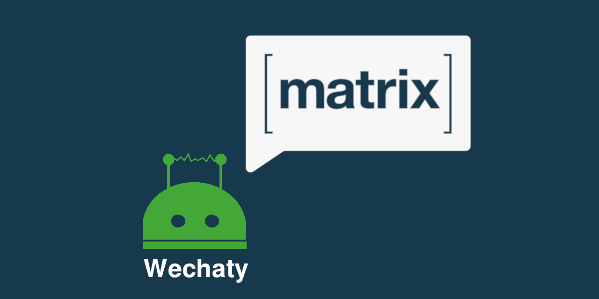

# matrix-appservice-wechaty [![[M] Matrix](https://img.shields.io/matrix/matrix-appservice-wechaty:matrix.org)](https://matrix.to/#/#matrix-appservice-wechaty:matrix.org)

Wechat (微信) Matrix Application Services Bridge


> Image credit: [Gnosis](https://blog.gnosis.pm/we-are-moving-our-open-gnosis-community-chat-to-matrix-542e9017499)

[](https://github.com/wechaty/wechaty)
[](https://badge.fury.io/js/matrix-appservice-wechaty)


[](https://www.typescriptlang.org/)

## What is [Matrix]

> [Matrix](https://matrix.org/blog/index) is an open network for secure, decentralized communication, like [Pidgin](http://pidgin.im) on your Phone.
>
> Pidgin try to IM all your friends in one place in Linux, and with Matrix you can have your Phone clinet with your private server which is highly customized. Matrix did not use XMPP protocol, it's server uses REST so that it could be more easy to extend.

The [Matrix] client [Riot](https://riot.im/app/) is a universal secure chat app entirely under your control. It supports all types of the platforms, including Web/Browser, Android, and iPhone.

## What is `matrix-appservice-wechaty`

`matrix-appservice-wechaty` is a WeChat (微信) Matrix AppService for bridging the Matrix user with WeChat user.

It has been officially listed at [[Matrix] Bridge Page for Wechaty](https://matrix.org/docs/projects/bridge/matrix-appservice-wechaty).

According to [Types of Bridging](https://matrix.org/docs/guides/types-of-bridging), Wechaty Bot in Matrix will create an [Simple Puppeted Bridge](https://matrix.org/docs/guides/types-of-bridging#simple-puppeted-bridge) with [Portal Rooms](https://matrix.org/docs/guides/types-of-bridging#portal-rooms) because we want to bring all conversations from Wechat to Matrix, and let the Matrix user control his account on Wechat.

## Features

1. Support connect to Wechat via [Web](https://github.com/wechaty/wechaty-puppet-puppeteer)/[iPad](https://github.com/wechaty/wechaty-puppet-padplus)/[Hostie](https://github.com/wechaty/wechaty-puppet-hostie)/Windows/Mac Protocol, with the power of [Wechaty](https://github.com/wechaty)
1. Map all Wechat users/room/official accounts to Matrix virtual users

## Requirements

1. A Matrix homeserver that supports application services (e.g. [Synapse](https://github.com/matrix-org/synapse))
1. Node.js wit NPM, or Docker

## Installation

[](https://badge.fury.io/js/matrix-appservice-wechaty)
[](https://www.npmjs.com/package/matrix-appservice-wechaty?activeTab=versions)

```sh
sudo npm install -g matrix-appservice-wechaty
```

`matrix-appservcie-wechaty` is all you need.

### 1 Configure `config.yaml`

Copy [config/config.sample.yaml](https://github.com/chatie/matrix-appservice-wechaty/blob/master/config/config.sample.yaml) to `config.yaml` and update it to match your setup.

1. `domain` needs to change to your domain name, which should points to your homeserver.
1. `homeserverUrl` needs to change to your homeserver url, with the port number included.
1. `registration` needs to change to your registration yaml file name (see next part for how to generate it)

### 2 Generate `wechaty-registration.yaml`

After we setup the `config.yaml`, then we can generate the `wechaty-registration.yaml` file for  registing to the home server:

```sh
export APP_SERVICE_ENDPOINT='http://localhost:8788'

matrix-appservice-wechaty \
  --config  config.yaml \
  --url     "$APP_SERVICE_ENDPOINT" \
  --generate-registration
```

Note: The URL `APP_SERVICE_ENDPIOINT` is used by the home server to communite with appservice, in this example is: `http://localhost:8788`. If you have other appservices, or other requirements, pick an appropriate hostname and port.

### 3 Register the App Service

Edit your `homeserver.yaml` file and update the `app_service_config_files` entry with the path to the `wechaty-registration.yaml` file.

```json
app_service_config_files: ["/data/wechaty-registration.yaml"]
```

### 4 Restart Home Server (Synapse)

You will then need to restart the synapse server.

For docker users:

```sh
export SYNAPSE_CONTAINER_ID=$(docker ps | grep synapse | awk '{print $1}')
docker restart $SYNAPSE_CONTAINER_ID
```

Or if you are not using docker:

```sh
synctl restart
```

Remember to restart it every time the registration file is updated.

## Launch the Wechaty AppService Bridge

Let's start the `matrix-appservice-wechaty` bridge, with the port specified in `wechaty-registration.yaml` (`8788` in the above example)

```shell
export WECHATY_PUPPET=wechaty-puppet-padplus
export WECHATY_PUPPET_PADPLUS_TOKEN=xxxxxxxxxxxxxxxxxxxxx

matrix-appservice-wechaty \
  --config  config.yaml \
  --file    wechaty-registration.yaml
```

> Note: [Wechaty](https://github.com/wechaty/wechaty) is a very powerful framework that supporting Web, iPad, Win32, Mac, iOS protocols of WeChat. Learn more about WeChaty protocols at our [Wechaty Puppet Directory](https://github.com/wechaty/wechaty-puppet/wiki/Directory), and you can apply for a token for using [wechaty-puppet-padplus](https://github.com/wechaty/wechaty-puppet-padplus) at our [Support Developers Program](https://github.com/wechaty/wechaty/wiki/Support-Developers)

The bridge should start working shortly afterwards.

The current path (`$(pwd)`) should have the `wechaty-registration.yaml` file and `config.yaml` file. Additional bridge-related data will be stored here.

## Examples

### Example `wechaty-registration.yaml`

```yaml
id: wechaty
hs_token: 4f2763d5cc6e931967ec89efdde1123772945184b4cbe99e8fa9538122015e92
as_token: c27815bdd699d2eaefb499c83f99ce1a7983a9688811269fbcc17b632b0b250e
namespaces:
  users:
    - exclusive: true
      regex: '@wechaty_.*'
  aliases:
    - exclusive: true
      regex: '#wechaty_.*'
  rooms: []
url: matrix.chatie.io:8788
sender_localpart: wechaty
rate_limited: false
protocols:
  - wechaty
```

### Example `config.yaml`

```yaml
domain: chatie.io
homeserverUrl: https://matrix.chatie.io
registration: wechaty-registration.yaml
```

### Example Docker Compose File

[](https://hub.docker.com/r/wechaty/matrix-appservice)

We have published a docker image [wechaty/matrix-appservice](https://hub.docker.com/r/wechaty/matrix-appservice) for your convenience.

You can use docker to run matrix-appservice-wechaty bridge by adding the following configs to your `docker-compose.yml`

```yaml
matrix-appservice-wechaty:
  container_name: matrix-appservice-wechaty
  image: wechaty/matrix-appservice
  volumes:
  - ./bridges/matrix-appservice-wechaty:/data
  networks:
  - default
  environment:
  - WECHATY_PUPPET_PADPLUS_TOKEN=puppet_padplus_<token>
  - WECHATY_PUPPET=wechaty-puppet-padplus
  command: ["--config", "/data/config.yaml", "--file", "/data/wechaty-registration.yaml", "--port", "8788"]
```

## Beidge Usage

1. Talk to Wechaty Bot (`@wechaty:your.domain.ltd`)
1. Send the message `!login` (three times ... wip... )
1. The `wechaty` app service bot will then send you a QR Code for scanning by WeChat.

After scan the QR Code and confirm on your phone, everything will be setup automatically by the wechaty bot.

### Authentication

#### Logging in

1. Start a chat with the bridge bot. The bot should say _"This room has been registered as your bridge management/status room."_ if you started the chat correctly.
1. Run `!login`
1. Log in by scanning the QR code. If the code expires before you scan it, the bridge will send an error to notify you.
    1. Open Wechat on your phone.
    1. Tap Menu or Settings and select Scan.
    1. Point your phone at the image sent by the bot to capture the code.
1. Finally, the bot should inform you of a successful login and the bridge should start creating portal rooms for all your Wechat groups and private chats.

#### Logging out

Simply run the `!logout` management command.

## Install Matrix Server

By following the guide from [@spantaleev](https://github.com/spantaleev), you can set your matrix server up just in dozens of minutes.

- [Matrix (An open network for secure, decentralized communication) server setup using Ansible and Docker](https://github.com/spantaleev/matrix-docker-ansible-deploy/blob/master/docs/README.md)

### TODO

Distill steps to setup the matrix server from <https://github.com/spantaleev/matrix-docker-ansible-deploy/blob/master/docs/README.md>

## See Also

- [Matrix Application Services](https://matrix.org/docs/guides/application-services)
- [Matrix Javascript SDK v2.0](https://matrix-org.github.io/matrix-js-sdk/2.0.1/index.html)
- [Bridging infrastructure for Application Services - HOWTO](https://github.com/matrix-org/matrix-appservice-bridge/blob/master/HOWTO.md)
- [Matrix Application Service Bridge Node.js SDK](http://matrix-org.github.io/matrix-appservice-bridge/)
- [Matrix Application Service API](https://matrix.org/docs/spec/application_service/r0.1.0.html)
- [Matrix Client-Server API](https://matrix.org/docs/spec/client_server/r0.4.0.html)
- [Matrix Specification](https://matrix.org/docs/spec/)

### Matrix AppService Bridges in TypeScript

- [A bridge between Matrix and Discord](https://github.com/Half-Shot/matrix-appservice-discord)

### Matrix AppService Bridges in JavaScript

- [Matrix<->Skype user-puppeting portal](https://github.com/mobitel-ltd/matrix-skype-bridge)
- [Communication Matrix with Skype via puppet](https://github.com/mobitel-ltd/mobitel-matrix-puppet-skype)
- [Matrix AppService Bridge Gitter](https://github.com/matrix-org/matrix-appservice-gitter)
- [Node.js Telegram bridge for Matrix](https://github.com/FruitieX/matrix-appservice-telegram)
- [Slack-compatible webhooks for matrix](https://github.com/turt2live/matrix-appservice-webhooks)
- [A matrix SMS bridge, powered by Twilio](https://github.com/turt2live/matrix-appservice-twilio)
- [Node.js IRC bridge for Matrix](https://github.com/matrix-org/matrix-appservice-irc)

## Background

- [Integrate Wechat with Matrix with the power of Wechaty #1737](https://github.com/wechaty/wechaty/issues/1737)

>
> This week I had a great talk with YC partner Eric @[ericmigi](https://github.com/ericmigi), who is a serial entrepreneur and also a geek with technology. He uses Matrix a lot and almost integrated all the instance messanger to his Matrix.
>
> But, the matrix does not support Wechat yet. So we'd like to introduce a matrix-wechat bridge to implement the Wechat protocol, and fill the gap between Matrix and Wechat.
>
> @[ericmigi](https://github.com/ericmigi) provide some links that will help us to kick off a starter, hope we could make a workable POC soon, and any contribution will be welcome.
>
> 1. [homeserver install in 1 hr](https://github.com/spantaleev/matrix-docker-ansible-deploy)
> 1. [examples of puppet bridges](https://github.com/matrix-hacks/matrix-puppet-bridge)
>
> &mdash; <cite>Huan, April 2019</cite>

---

> @[tulir](https://github.com/tulir) has very rich experiences with building the matrix bridges such as:
>
> 1. [A Matrix-Telegram hybrid puppeting/relaybot bridge](https://github.com/tulir/mautrix-telegram)
> 1. [A Matrix-WhatsApp puppeting bridge](https://github.com/tulir/mautrix-whatsapp)
>
> &mdash; <cite>Huan, May 2019</cite>

## Todo/Question List

- [ ] How to get room list from the matrix homeserver from matrix-appservice-bridge ?
- [ ] How to get members from a room from the homeserver matrix-appservice-bridge ?
- [ ] Use Matrix Remote Room for linking WeChat Room with Matrix Room.

## History

### master

### v0.8 Mar 1, 2020

Finished  [#13](https://github.com/Chatie/matrix-appservice-wechaty/issues/13): [TypeScript] Add typing system to `matrix-js-sdk` and `matrix-appservice-bridge`.

1. Code Refactoring
1. Add `!login`, `!logout` command with help message
1. Tested with iPad API([wechaty-puppet-padplus](https://github.com/wechaty/wechaty-puppet-padplus))

### v0.6 (Beta) Feb 25, 2020

1. added docker-compose.yaml example. (thanks @[ericmigi](https://github.com/ericmigi))
1. Added install documentation

### v0.4 (Alpha) July 14, 2019

1. Support receive/send Wechat message in Matrix. (individuals and rooms)
1. Tested with Web API([wechaty-puppet-puppeteer](https://github.com/wechaty/wechaty-puppet-puppeteer)) and iPad API([wechaty-puppet-padpro](https://github.com/botorange/wechaty-puppet-padpro))

#### Known Issues

1. The names/avatars of Wechat users/groups are not set right on Matrix.
1. Only support text message, Image/Audio/Video message is not supported yet. (Will be supported in the future version)
1. Appservice will create more than one matrix room for a Wechat room when receiving messages from it for the very first time. (It will stop creating new rooms after you accepted the invitation)
1. Login QR Code should not use the 3rd party API for security considerations. A better way is to upload the QR Code image to matrix server instead.

### v0.2 July 6,  2019

1. Enable your matrix account to start using `matrix-appservice-wechaty` by talk to the bot `@wechaty:your.domain`
1. After you talk to `@wechaty`, it will send you Wechat Login QR Code. Scan it to login Wechat
1. All Wechat messages will be bridged to the Matrix system, in the room that you talk to the bot at the very first time.

### v0.0.1 May 2019

1. Auto response the message in a Matrix Room.

## Disclaimer

I accept no responsibility if Tencent ban your IP, Account or even your details on their system. They have never given official support on custom clients.

> &mdash; Credit: [matrix-appservice-discord](https://github.com/Half-Shot/matrix-appservice-discord/blob/master/docs/puppeting.md#caveats--disclaimer)

## Author

[Huan](https://github.com/huan) [(李卓桓)](http://linkedin.com/in/zixia) Tencent TVP of Chatbot, <zixia@zixia.net>

[](https://stackexchange.com/users/265499)

## Copyright & License

- Code & Docs © 2019-now Huan (李卓桓) <zixia@zixia.net>
- Code released under the Apache-2.0 License
- Docs released under Creative Commons
